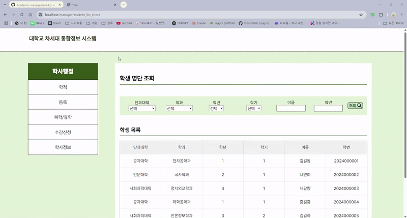

# 학사 관리 웹 사이트

## 🖥️ 프로젝트 소개
학원에서 진행한 팀 프로젝트에서는 여러 의견이 나왔습니다. 그 중 기존에 사용하고 있던 웹사이트가 불편하다는 점을 개선하고자, 이를 팀 프로젝트로 구현해보자는 의견을 바탕으로 프로젝트를 시작하게 되었습니다. 학생과 관리자 페이지를 별도로 구현하여 각기 다른 기능을 제공하는 방식으로 진행하였습니다.

  

---

## 📅 개발 기간

- 2024.07 ~ 2024.08

---

## 🛠️ 개발 환경

- ### Frontend

  
  
  
  

- ### Backend

  
  
  

- ### Tool

  

- ### Collaboration

  
  
